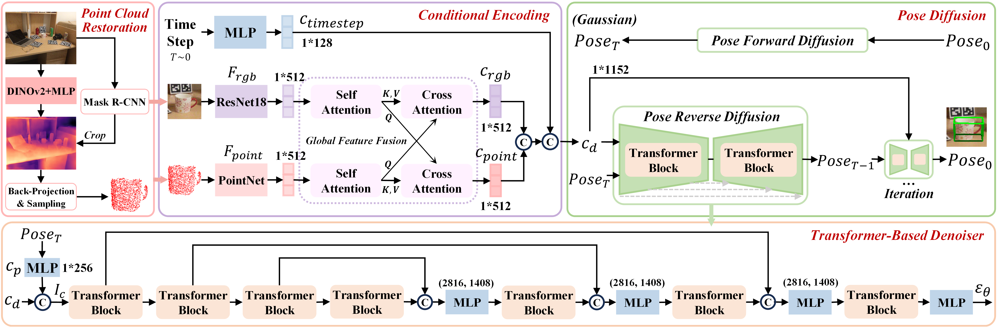

## MonoDiff9D: Monocular Category-Level 9D Object Pose Estimation via Diffusion Model (ICRA'25)

This is the PyTorch implementation of paper **[MonoDiff9D](https://arxiv.org/abs/2504.10433)** published in <b>*IEEE ICRA'25*</b> by <a href="https://cnjliu.github.io/">J. Liu</a>, <a href="http://robotics.hnu.edu.cn/info/1071/1265.htm">W. Sun</a>, <a href="https://github.com/CNJianLiu/MonoDiff9D">H. Yang</a>, <a href="https://github.com/CNJianLiu/MonoDiff9D">J. Zheng</a>, <a href="https://github.com/CNJianLiu/MonoDiff9D">Z. Geng</a>, <a href="https://sites.google.com/view/rahmaniatlu">H. Rahmani</a>, and <a href="https://ajmalsaeed.net/">A. Mian</a>. MonoDiff9D is an extension of [Diff9D](https://github.com/CNJianLiu/Diff9D), aiming to achieve monocular category-level 9D object pose estimation via diffusion conditioning on LVM-based zero-shot depth recovery. 

<p align="center">

</p>

## Oral Presentation (Click to see)
[](https://youtu.be/0rqnJpz4s_o)

## Installation
Our code has been trained and tested with:
- Ubuntu 20.04
- Python 3.8.15
- PyTorch 1.12.0
- CUDA 11.3

Complete installation can refer to our [environment](https://github.com/CNJianLiu/MonoDiff9D/blob/main/environment.yaml).

## Datasets
Download the [NOCS](https://github.com/hughw19/NOCS_CVPR2019) dataset ([camera_train](http://download.cs.stanford.edu/orion/nocs/camera_train.zip), [camera_test](http://download.cs.stanford.edu/orion/nocs/camera_val25K.zip), [camera_composed_depths](http://download.cs.stanford.edu/orion/nocs/camera_composed_depth.zip), [real_train](http://download.cs.stanford.edu/orion/nocs/real_train.zip), [real_test](http://download.cs.stanford.edu/orion/nocs/real_test.zip),
[ground truths](http://download.cs.stanford.edu/orion/nocs/gts.zip), [mesh models](http://download.cs.stanford.edu/orion/nocs/obj_models.zip), and [segmentation results](https://drive.google.com/file/d/1hNmNRr7YRCgg-c_qdvaIzKEd2g4Kac3w/view?usp=sharing)) and Wild6D ([testset](https://ucsdcloud-my.sharepoint.com/:u:/r/personal/yafu_ucsd_edu/Documents/Wild6D/test_set.zip)). Data processing can refer to [IST-Net](https://github.com/CVMI-Lab/IST-Net). Unzip and organize these files in ../data as follows:
```
data
├── CAMERA
├── camera_full_depths
├── Real
├── gts
├── obj_models
├── segmentation_results
├── Wild6D
```
We provide the [real_test](https://drive.google.com/drive/folders/1Vt2ejrx-qymPv0KOENEDdnOkXabmyF_U?usp=sharing) dataset generated by MonoDiff9D. Other datasets can be generated easily based on the "../tools/depth_recovery.py" file.

## Evaluation
You can download our pretrained model [epoch_300.pth](https://drive.google.com/file/d/1ZDk0nqsekIXFcUOVdxxnP8AbKF8zZWip/view?usp=sharing) and put it in the '../log1/rgb_diffusion_pose' directory. Then, you can quickly evaluate using the following command:
```
python test.py --config config/rgb_diffusion_pose.yaml
```

## Training
To train the model, remember to download the complete datasets and organize & preprocess them properly.

train.py is the main file for training. You can start training using the following command:
```
python train.py --gpus 0 --config config/rgb_diffusion_pose.yaml
```

## Citation
If you find our work useful, please consider citing:
```latex
@InProceedings{MonoDiff9D,
  title={MonoDiff9D: Monocular Category-Level 9D Object Pose Estimation via Diffusion Model},
  author={Liu, Jian and Sun, Wei and Yang, Hui and Zheng, Jin and Geng, Zichen and Rahmani, Hossein and Mian, Ajmal},
  booktitle = {IEEE International Conference on Robotics and Automation (ICRA)},
  year={2025}
}
```

## Acknowledgment
Our implementation leverages the code from [Diff9D](https://github.com/CNJianLiu/Diff9D), [DPDN](https://github.com/JiehongLin/Self-DPDN), and [IST-Net](https://github.com/CVMI-Lab/IST-Net).

## Licence

This project is licensed under the terms of the MIT license.

